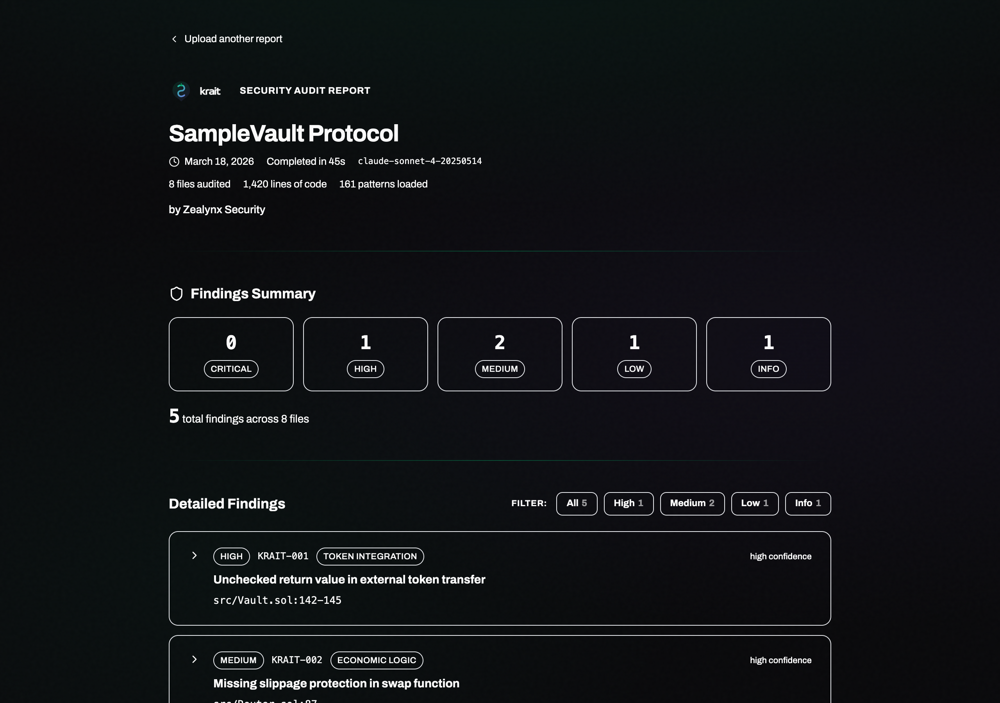

# Krait

**AI security auditor for Solidity smart contracts.** Finds real vulnerabilities with concrete exploit traces — tested blind against 40 Code4rena contests at 90% precision. Runs inside [Claude Code](https://docs.anthropic.com/en/docs/claude-code) as a set of skills. Free — uses your existing Claude subscription.

Krait is two things that work together:

**1. Audit skills** (this repo) — run `/krait` in Claude Code, get findings locally. Free.

**2. Web platform** ([krait.zealynx.io](https://krait.zealynx.io)) — upload findings for branded reports, track projects over time, run an 845+ check security assessment covering process-level gaps code analysis can't see. Also free.

```
/krait (local)  →  Upload findings  →  Save to dashboard  →  Run assessment  →  Combined score
     |                   |                    |                      |                  |
  Claude Code    krait.zealynx.io     Track over time      845+ checks       60/40 weighted
   (free)         /report/findings       /dashboard             /new             /dashboard
```

Built by [Zealynx Security](https://zealynx.io).

## What Krait Does

Krait is a structured audit methodology encoded as Claude Code skills. When you run `/krait` on a Solidity project, it executes a 4-phase pipeline:

1. **Recon** — maps the architecture, extracts the AST, scores every file by risk, selects protocol-specific detection primers
2. **Detection** — analyzes each high-risk function from 16 angles (4 technical lenses x 4 independent mindsets), with consensus scoring across passes
3. **State Analysis** — finds coupled state pairs and mutation patterns that per-function scanning misses
4. **Verification** — 8 kill gates try to disprove every finding. Only those with a concrete exploit trace (WHO does WHAT to steal HOW MUCH) survive

The output is a structured report with findings at exact file:line locations, vulnerable code, suggested fixes, and exploit traces. Saved as both markdown and JSON.



## What Krait Is Not

- Not a linter or regex scanner — Claude reads and reasons about code
- Not a SaaS product with API costs — runs locally in your Claude Code session
- Not a replacement for a professional audit — it's a tool that catches real bugs before your auditor does

---

## Quick Start

### Requirements

- [Claude Code](https://docs.anthropic.com/en/docs/claude-code) (CLI, VS Code extension, or Cursor)
- A Claude subscription (Pro, Max, or Team)
- A Solidity project to audit

### Install

```bash
git clone https://github.com/ZealynxSecurity/krait.git
mkdir -p ~/.claude/commands ~/.claude/skills
cp -r krait/.claude/commands/* ~/.claude/commands/
cp -r krait/.claude/skills/* ~/.claude/skills/
```

Open Claude Code in any Solidity project and run `/krait`.

### Update

```bash
cd krait && git pull
cp -r .claude/commands/* ~/.claude/commands/
cp -r .claude/skills/* ~/.claude/skills/
```

### Commands

| Command | What it does |
|---------|-------------|
| `/krait` | Full 4-phase audit: Recon → Detection → State Analysis → Verification → Report |
| `/krait-quick` | Same pipeline, skips state analysis — ~2x faster |

Both output to `.audit/` in your project directory.

### After the Audit

Every run saves findings to `.audit/krait-findings.json` and shows:

```
───────────────────────────────────────────────────
📋 N findings saved to .audit/krait-findings.json

🔗 View this report online:
   https://krait.zealynx.io/report/findings

📊 Track findings over time:
   https://krait.zealynx.io/dashboard
───────────────────────────────────────────────────
```

Findings are already verified — the critic phase requires a concrete exploit trace for every H/M before it reaches the report.

---

## How Detection Works

### Multi-Mindset Analysis (v7.0)

Each of the 4 detection lenses analyzes code through 4 independent mindsets simultaneously:

| Mindset | Question |
|---------|----------|
| **Attacker** | "How would I exploit this to drain funds or escalate privilege?" |
| **Accountant** | "Trace every wei — do the numbers add up?" |
| **Spec Auditor** | "Does the code match what docs, comments, and EIPs say it should do?" |
| **Edge Case Hunter** | "What breaks at zero, max, empty, self-referential, or reentrant?" |

Every function in high-risk files gets examined from **16 angles** (4 lenses x 4 mindsets). Findings discovered by multiple mindsets get a consensus boost; single-source findings get extra scrutiny.

### Kill Gates (Verification)

Eight automatic gates try to **disprove every finding** before it reaches you:

- **A**: Generic best practice ("use SafeERC20") · **B**: Theoretical/unrealistic
- **C**: Intentional design · **D**: Speculative (no WHO/WHAT/HOW MUCH)
- **E**: Admin trust · **F**: Dust (<$100) · **G**: Out of context · **H**: Known issue

Result: FPs dropped from 4.2/contest → 0.2/contest (**95% reduction**). They've never killed a true positive across 40 contests.

---

## Benchmarks

Tested blind against 40 Code4rena contests. No other AI audit tool publishes precision/recall against real competitions.

| Version | Contests | Precision | FPs/Contest |
|---------|----------|-----------|-------------|
| v1 | 1-3 | 12% | 1.3 |
| v5 | 31-35 | 70% | 0.6 |
| **v6.4** | **36-40** | **90%** | **0.2** |

**Latest 5 contests (v6.4):**

| Contest | Type | Official H+M | TPs | FPs | Precision |
|---------|------|-------------|-----|-----|-----------|
| LoopFi | Lending/Looping | 45 | 2 | 0 | **100%** |
| DittoETH | Stablecoin/OrderBook | 16 | 1 | 1 | 50% |
| Phi | Social/NFT | 15 | 1 | 0 | **100%** |
| Vultisig | ILO/Token | 6 | 2 | 0 | **100%** |
| Predy | DeFi Derivatives | 12 | 1 | 0 | **100%** |

Every result is verifiable in [`shadow-audits/`](shadow-audits/).

### Self-Improving

After each blind test: score → root-cause every miss → update methodology → re-test. This loop produced 50+ heuristics, 30 modules, and 7 protocol-specific primers from real missed findings.

---

## Real Bugs Found (Blind)

- **AuraVault claim double-spend** (LoopFi H-401) — fees not deducted, draining vault
- **UniV3 fee drain via shared position** (Vultisig H-43) — first claimer steals all fees
- **ILO launch DoS** (Vultisig H-41) — slot0 manipulation blocks all launches
- **Public internals → permanent fund lock** (Phi H-51) — state corruption locks ETH
- **Both HIGHs** (Munchables) — lockOnBehalf griefing + early unlock, 100% precision
- **Assembly encoding bug** (DittoETH M-221) — `add` vs `and` corrupts data
- ERC4626 inflation (Basin), reentrancy (reNFT), EIP-712 mismatch (reNFT), oracle precision (Dopex), TVL error (Renzo)

---

## Detection Coverage

**Strong on**: Reentrancy/CEI, access control gaps, oracle issues, EIP/ERC compliance, first-depositor inflation, accounting errors, assembly bugs, pause bypasses

**Improving**: Complex math (CDP liquidation, options pricing), cross-chain edge cases, game mechanic exploits, protocol-specific integrations (Curve, UniV3 tick math), economic design flaws

---

## Web Platform — [krait.zealynx.io](https://krait.zealynx.io)

### Upload & View Reports

Upload `.audit/krait-findings.json` at [krait.zealynx.io/report/findings](https://krait.zealynx.io/report/findings) for a branded report with severity breakdowns, exploit traces, and code diffs. Save to your dashboard to track over time.

### Security Assessment (845+ Checks)

Interactive audit readiness checklist covering **39 DeFi verticals** — operational security, deployment practices, documentation, upgrade procedures, and process gaps code analysis can't see. Backed by 4,500+ real findings from [Solodit](https://solodit.xyz).

Start at [krait.zealynx.io/new](https://krait.zealynx.io/new).

### Dashboard

[krait.zealynx.io/dashboard](https://krait.zealynx.io/dashboard) — all projects in one place. Assessment scores, scan findings, combined readiness score (60% assessment + 40% scan), activity timeline.

---

## Author

**Carlos Vendrell Felici** — Founder, [Zealynx Security](https://zealynx.io)
[Twitter/X](https://x.com/TheBlockChainer) · [GitHub](https://github.com/vendrell46)

## License

[MIT](LICENSE) © Zealynx Security
