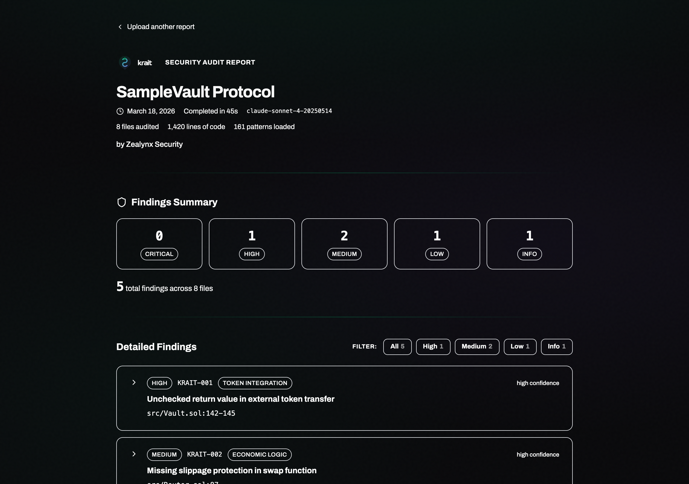

# Krait

**AI-assisted security verification for Solidity smart contracts.** Not a scanner — a structured methodology with 101 heuristics, 26 analysis modules, and 8 kill gates, tested blind against 50 Code4rena contests at **100% precision**. Runs inside [Claude Code](https://docs.anthropic.com/en/docs/claude-code). Free.

### At a Glance

| | |
|---|---|
| **Current version** | v8.2 (kill-gate parity, Impact Premise, rescan + per-contract recall phases) |
| **Measured baseline** | **v8** — 50 contests. v8.1/v8.2 are not yet re-measured ([why](METHODOLOGY.md#-unvalidated-since-the-v8-baseline)) |
| **Detection angles** | 16 per function (4 lenses × 4 mindsets) |
| **Heuristics** | 43 original + 58 extended (from open-source community) |
| **Analysis modules** | 15 deep-dive module files + 26 inline modules (A-X) |
| **Audit-trail rules** | R8 / R10 / R11 / R12 / R15 / R16 — exercised per finding (v8.1) |
| **Domain primers** | 7 (DEX, Lending, Staking, GameFi, Bridges, Proxies, Wallets) |
| **Kill gates** | 8 automatic + Impact Premise + 10 FP patterns (identical on both surfaces, parity-tested) |
| **Shadow audits** | 50 contests, 100% precision, 0 FPs/contest (v8 baseline) |
| **Full methodology** | [`METHODOLOGY.md`](METHODOLOGY.md) — every technique, publicly documented |

### Two Local Surfaces, One Web Platform

This repo ships **two** Claude Code surfaces. They answer different questions, and you can run either or both.

| | **Audit pipeline** (`/krait`) | **Checklist plugin** (`/krait:scan`) |
|---|---|---|
| Question it answers | "What bugs are in this code?" | "Am I ready for an audit?" |
| Method | Multi-phase adversarial reasoning from first principles | 845 curated checks across 39 DeFi verticals |
| Output | Exploit traces with file:line, severity, suggested fix | Per-check verdicts, importable assessment JSON |
| Bar | Zero false positives — 8 kill gates try to disprove every finding | Coverage — every applicable check gets a verdict |
| Lives in | `.claude/`, `src/` | [`checklist/`](checklist/) |
| Install | `./scripts/install.sh` | `/plugin marketplace add ZealynxSecurity/krait` |

Use the checklist to find out where you stand before an audit; use the audit pipeline to find the actual bugs.

**Web platform** ([krait.zealynx.io](https://krait.zealynx.io)) — AI-assisted security verification with per-check prompt generation, auto-parsed verdicts, shareable reports, and PDF export. Both local surfaces produce output you can upload to it. Also free.

```
┌─────────────────────────────────────────────────────────────────────────┐
│  /krait (local)                     krait.zealynx.io (web)             │
│  ─────────────                      ────────────────────               │
│  Run audit in Claude Code           845+ checks across 39 DeFi types  │
│  4-phase pipeline                   "Verify with AI" per check        │
│  Findings with exploit traces       ├─ Generates tailored prompt      │
│  .audit/krait-findings.json         ├─ Run in any IDE AI              │
│         │                           ├─ Paste response back            │
│         └──► Upload to dashboard    └─ Auto-detect verdict + files    │
│              Shareable reports       Shareable reports + PDF export    │
│              Track over time         Combined readiness score          │
└─────────────────────────────────────────────────────────────────────────┘
```

Built by [Zealynx Security](https://zealynx.io) — 30+ DeFi protocol audits.

## What Krait Does

Krait is a structured audit methodology encoded as Claude Code skills. When you run `/krait` on a Solidity project, it executes a 4-phase pipeline:

1. **Recon** — maps the architecture, extracts the AST, scores every file by risk, selects protocol-specific detection primers
2. **Detection** — analyzes each high-risk function from 16 angles (4 technical lenses x 4 independent mindsets), with consensus scoring across passes
3. **Rescan** — a second broad pass told exactly what pass 1 found, so its attention goes to the gaps. Skips itself if pass 1 found nothing above Informational
4. **Per-contract** — one agent per inheritance cluster at maximum depth, countering the dilution that makes a whole-codebase agent skim everything after the two most interesting files
5. **State Analysis** — finds coupled state pairs and mutation patterns that per-function scanning misses
6. **Verification** — 8 kill gates try to disprove every finding, and the Impact Premise gate demands a harm statement (WHO loses WHAT) before any trace. Only findings with a concrete exploit trace survive

The output is a structured report with findings at exact file:line locations, vulnerable code, suggested fixes, and exploit traces. Saved as both markdown and JSON.



## What Krait Is Not

- Not a linter or regex scanner — Claude reads and reasons about code
- Not a SaaS product with API costs — runs locally in your Claude Code session
- Not a replacement for a professional audit — it's a tool that catches real bugs before your auditor does

---

## Quick Start

### Requirements

- [Claude Code](https://docs.anthropic.com/en/docs/claude-code) (CLI, VS Code extension, or Cursor)
- A Claude subscription (Pro, Max, or Team)
- A Solidity project to audit

### Install

```bash
git clone https://github.com/ZealynxSecurity/krait.git
cd krait && ./scripts/install.sh
```

That single command:

1. copies the commands and skills into `~/.claude/`
2. builds both bundled MCP servers
3. registers them with Claude Code at **user scope**, so they work in every project — not just inside this clone

Open Claude Code in any Solidity project and run `/krait`. No API keys needed for any of it.

Preview without touching anything: `./scripts/install.sh --dry-run`.
Skip the MCP servers entirely: `./scripts/install.sh --no-mcp` (the skills work fine without them).

### Update

```bash
cd krait && git pull && ./scripts/install.sh
```

Re-running the installer is safe and idempotent — it refreshes the skills and re-points the
MCP registration at this clone's current path.

### The MCP servers

| Server | What it adds | Used by |
|--------|--------------|---------|
| `krait-solodit` | Local search over the Solodit-derived vulnerability patterns in `patterns/` | Detection |
| `krait-forge` | `forge build` / `test` / `fmt-check` without round-tripping shell output | `/krait-fuzz`, PoC verification |

Both are optional, run locally, and need no API key. If you'd rather wire them by hand:

```bash
npm run mcp:build   # build only
claude mcp add krait-solodit --scope user -- node "$PWD/mcp-servers/solodit/build/index.js"
claude mcp add krait-forge   --scope user -- node "$PWD/mcp-servers/forge/build/index.js"
```

`npm install` in the clone also builds them via a postinstall step (set
`KRAIT_SKIP_MCP_BUILD=1` to opt out). Run `/krait-init` at any time to see what's wired up.

### Commands

| Command | What it does |
|---------|-------------|
| `/krait` | Full 4-phase audit: Recon → Detection → State Analysis → Verification → Report (auto-runs preflight first) |
| `/krait-quick` | Same pipeline, skips state analysis — ~2x faster |
| `/krait-review` | Second opinion on killed findings — re-examines aggressive gate decisions |
| `/krait-fuzz` | Invariant extraction → Foundry test generation → run/fix loop |
| `/krait-init` | Standalone readiness check (tools, project shape, MCP wiring). `/krait` runs this automatically; this command is for CI setup and debugging. |
| `/krait-poc` | Write and run a Foundry PoC that proves an exploit by asserting the actual harm on a forked chain — or proves it does not reproduce. Emits `[POC-PASS]`/`[POC-FAIL]`. |

All output to `.audit/` in your project directory.

### Checklist commands (separate plugin)

Installed via the plugin marketplace rather than `scripts/install.sh`:

```bash
/plugin marketplace add ZealynxSecurity/krait
/plugin install krait@krait
```

(`krait@krait` = plugin `krait` from marketplace `krait`. Verified end to end with
`claude plugin install`; both manifests pass `claude plugin validate`.)

| Command | What it does |
|---------|-------------|
| `/krait:scan` | Quick scan — auto-detects the vertical, applies its checks |
| `/krait:assess` | Full check-by-check assessment; emits `.zealynx-run.json` for the web platform |
| `/krait:check LN-01` | Deep analysis of a single framework check against your code |

845 checks across 39 verticals, derived from 4,500+ Solodit audit findings. Runs locally, no API key. See [`checklist/README.md`](checklist/README.md).

### After the Audit

Every run saves findings to `.audit/krait-findings.json` and shows:

```
───────────────────────────────────────────────────
📋 N findings saved to .audit/krait-findings.json

🔗 View this report online:
   https://krait.zealynx.io/report/findings

📊 Track findings over time:
   https://krait.zealynx.io/dashboard
───────────────────────────────────────────────────
```

Findings are already verified — the critic phase requires a concrete exploit trace for every H/M before it reaches the report.

If the critic killed many candidates, run `/krait-review` to get a second opinion on the gate decisions.

---

## How Detection Works

### Multi-Mindset Analysis (v7.0)

Each of the 4 detection lenses analyzes code through 4 independent mindsets simultaneously:

| Mindset | Question |
|---------|----------|
| **Attacker** | "How would I exploit this to drain funds or escalate privilege?" |
| **Accountant** | "Trace every wei — do the numbers add up?" |
| **Spec Auditor** | "Does the code match what docs, comments, and EIPs say it should do?" |
| **Edge Case Hunter** | "What breaks at zero, max, empty, self-referential, or reentrant?" |

Every function in high-risk files gets examined from **16 angles** (4 lenses x 4 mindsets). Findings discovered by multiple mindsets get a consensus boost; single-source findings get extra scrutiny.

### Kill Gates (Verification)

Eight automatic gates try to **disprove every finding** before it reaches you:

- **A**: Generic best practice ("use SafeERC20") · **B**: Theoretical/unrealistic
- **C**: Intentional design · **D**: Speculative (no WHO/WHAT/HOW MUCH)
- **E**: Admin trust · **F**: Dust (<$100) · **G**: Out of context · **H**: Known issue

Result: FPs dropped from 4.2/contest → 0.0/contest in v7 (**100% reduction**). The last 10 contests (v6.4+v7) had only 1 total FP across 10 contests.

### Second Opinion (`/krait-review`)

The kill gates are aggressive by design — zero false positives is the priority. But aggressive gates can over-kill. Run `/krait-review` after an audit to re-examine killed findings with fresh eyes:

- **Gate C** (intentional design) — "intentional" doesn't always mean "safe"
- **Gate E** (admin trust) — missing timelocks and rug vectors are valid Mediums in many contests
- **Gate B** (theoretical) — retries exploit construction with flash loans, multi-block MEV
- **Gate F** (dust) — recalculates with protocol TVL context and accumulation analysis

Revived findings are surfaced as **"Worth Manual Review"** — flags for the auditor, not verified TPs. The main report's zero-FP standard is preserved.

---

## Benchmarks

Tested blind against 50 Code4rena contests. No other AI audit tool publishes precision/recall against real competitions.

| Version | Contests | Precision | Recall | FPs/Contest |
|---------|----------|-----------|--------|-------------|
| v1 | 1-3 | 12% | 5.8% | 1.3 |
| v5 | 31-35 | 70% | 9.5% | 0.6 |
| v6.4 | 36-40 | 90% | 11.8% | 0.2 |
| v7 | 41-45 | 100% | 11.0% | 0.0 |
| **v8** | **46-50** | **100%** | **15.2%** | **0.0** |

**Latest 5 contests (v8):**

| Contest | Type | Official H+M | TPs | FPs | Precision | Recall |
|---------|------|-------------|-----|-----|-----------|--------|
| PoolTogether | ERC-4626 Prize Vault | 9 | 1 | 0 | **100%** | 11% |
| GoodEntry | UniV3 Derivatives | 14 | 5 | 0 | **100%** | **36%** |
| Arcade | Governance/Voting | 8 | 2 | 0 | **100%** | **25%** |
| Frankencoin | CDP Stablecoin | 20 | 2 | 0 | **100%** | 10% |
| InitCapital | Lending/Hooks | 15 | 0 | 0 | N/A | 0% |

Every result is verifiable in [`shadow-audits/`](shadow-audits/).

> **v8 is the number Krait stands behind.** v8.1 and v8.2 changed the methodology after that
> measurement and have not been re-run over the registry. A 3-contest v8.1 pilot suggested a
> large recall gain, but n=3 against two-month-old baselines is a hint, not a benchmark —
> the figures and their caveats are quarantined in
> [METHODOLOGY.md § Unvalidated since the v8 baseline](METHODOLOGY.md#-unvalidated-since-the-v8-baseline)
> rather than mixed into the table above.

Changes are gated mechanically:

```bash
npm run shadow:regress -- --contests neobase,opendollar --update   # record a baseline
npm run shadow:regress -- --contests neobase,opendollar            # gate a change
```

Any new false positive fails the gate. So does a recall drop worse than 2 percentage points.

### Self-Improving

After each blind test: score → root-cause every miss → update methodology → re-test. This loop produced 43 original heuristics, 15 deep-dive module files, 58 extended heuristics, 26 inline modules, and 7 protocol-specific primers. v8 integrated open-source vectors from [pashov/skills](https://github.com/pashov/skills), [PlamenTSV/plamen](https://github.com/PlamenTSV/plamen), and [forefy/.context](https://github.com/forefy/.context) (all MIT) — improving recall from 11% to 15.2% while maintaining 100% precision.

**v8.1 (Tier A — methodology audit trail)** adds six structured fields to every detector / state-auditor / critic finding: `stepExecution` (which lenses/phases/gates ran), `rulesApplied` (R8 cached params, R10 worst-state severity, R11 unsolicited token transfer, R12 enabler enumeration, R15 flash-loan precondition, R16 oracle integrity), `depthEvidence` (`[BOUNDARY:…]` / `[VARIATION:…]` / `[TRACE:…]` concrete-value tags), `missingPrecondition` / `preconditionType`, `postconditionsCreated` / `postconditionTypes` / `whoBenefits`. Rules and tags are derived from [PlamenTSV/plamen](https://github.com/PlamenTSV/plamen)'s methodology framework, integrated under MIT.

**v8.2** closes the gap between Krait's two surfaces and adds recall. The 8 kill gates, the DoS exception and the 10 FP patterns now live in the TypeScript CLI critic as well as the skill — previously the CLI ran a generic reviewer prompt with none of them, even though the benchmark harness runs the CLI. Gate attribution is enforced in code rather than requested in a prompt, and a parity test suite fails the build when the two surfaces drift. On top of that: the Impact Premise gate (a finding must state WHO loses WHAT, not just what the machinery does), two exclusion-list recall phases (rescan, per-contract), trust-assumption downgrade instead of outright dismissal, and root-cause consolidation in the report.

**Neither v8.1 nor v8.2 has been re-measured across the 50-contest registry.** The v8 numbers below remain the honest baseline until it is. The gate that will do the measuring ships with this version: `npm run shadow:regress` blocks on any new false positive and on a recall drop worse than 2 pp.

---

## Real Bugs Found (Blind)

- **ONE_HUNDRED_WAD constant bug** (Open Dollar H-01) — surplus auction math inflated 100x, bricking protocol economics *(v7, CONST-01 heuristic)*
- **Gauge removal locks voting power** (Neobase H-01) — contradictory guards permanently trap user governance power *(v7, GAUGE-01 heuristic)*
- **Zero slippage on all swaps** (BakerFi H-04) — amountOutMinimum=0 enables sandwich on every deposit/withdraw *(v7)*
- **Oracle staleness OR vs AND** (BakerFi M-06) — stale price accepted if either feed is fresh *(v7)*
- **slot0 manipulation in TokenisableRange** (GoodEntry H-04) — flash loan manipulates UniV3 spot price, stealing depositor fees *(v8, amm-mev-deep module)*
- **Voting power not synced on multiplier change** (Arcade M-05) — stale inflated voting power after NFT boost update *(v8, governance-voting Pashov vector)*
- **claimYieldFeeShares zeroes entire balance** (PoolTogether H-01) — partial claim wipes all fee accounting *(v8, erc4626-vault-deep module)*
- **Challenger reward drains reserves** (Frankencoin H-06) — self-challenge extracts unlimited rewards *(v8, economic-design module)*
- **AuraVault claim double-spend** (LoopFi H-401) — fees not deducted, draining vault
- **UniV3 fee drain via shared position** (Vultisig H-43) — first claimer steals all fees
- **ILO launch DoS** (Vultisig H-41) — slot0 manipulation blocks all launches
- **Public internals → permanent fund lock** (Phi H-51) — state corruption locks ETH
- **Both HIGHs** (Munchables) — lockOnBehalf griefing + early unlock, 100% precision
- **Assembly encoding bug** (DittoETH M-221) — `add` vs `and` corrupts data
- ERC4626 inflation (Basin), reentrancy (reNFT), EIP-712 mismatch (reNFT), oracle precision (Dopex), TVL error (Renzo)

---

## Detection Coverage

**Strong on**: Reentrancy/CEI, access control gaps, oracle issues (Chainlink + Pyth), EIP/ERC compliance, first-depositor inflation, accounting errors, assembly bugs, pause bypasses, slot0/spot price manipulation, ERC-4626 vault accounting, governance voting power sync, AMM/MEV vectors

**Improving**: Complex math (CDP liquidation, options pricing), cross-chain edge cases, game mechanic exploits, custom hook/plugin architectures, protocol-specific integrations (Curve adapter edge cases)

---

## Web Platform — [krait.zealynx.io](https://krait.zealynx.io)

### Verify with AI (Unique Feature)

Every security check on the web platform generates a **tailored AI prompt** you can copy-paste into Claude Code, Cursor, Windsurf, or Codex. The prompt includes:

- The specific vulnerability to look for
- Real exploit examples from Solodit (protocols that were actually hacked)
- What secure code looks like (from mitigation data)
- Code patterns to grep for
- Structured output format (PASS/FAIL/NA with file:line references)

When you paste the AI's response back, Krait **auto-parses** it:
- Detects the verdict (PASS/FAIL/NOT APPLICABLE/NEEDS REVIEW)
- Extracts file:line references
- Scores confidence (high/medium/low)
- Auto-sets the check status

This turns every check from "do you think you're ok?" into "let's verify against your actual code with AI."

### Upload & View Reports

Upload `.audit/krait-findings.json` at [krait.zealynx.io/report/findings](https://krait.zealynx.io/report/findings) for a branded report with severity breakdowns, exploit traces, and code diffs. Share via persistent link or download as PDF.

### Security Verification (845+ Checks)

AI-assisted security verification covering **39 DeFi verticals** — each check backed by real Solodit exploit data, with "Verify with AI" prompts for every single one. Not a checklist you fill out manually — a verification pipeline that leverages your IDE's AI.

Start at [krait.zealynx.io/new](https://krait.zealynx.io/new).

### Dashboard

[krait.zealynx.io/dashboard](https://krait.zealynx.io/dashboard) — all projects in one place. Scan findings, verification scores, shareable reports, activity timeline.

---

## Detection Sources

Krait's detection layer combines original research with curated knowledge from the open-source security community. See [`ATTRIBUTION.md`](.claude/skills/krait/ATTRIBUTION.md) for details.

| Source | What We Integrated | License |
|--------|-------------------|---------|
| [pashov/skills](https://github.com/pashov/skills) | ~100 attack vectors across 8 modules + 58 extended heuristics | MIT |
| [PlamenTSV/plamen](https://github.com/PlamenTSV/plamen) | Devil's Advocate verification methodology | MIT |
| [forefy/.context](https://github.com/forefy/.context) | Protocol-type context enrichment (10,600+ findings) | MIT |

---

## Author

**Carlos Vendrell Felici** — Founder, [Zealynx Security](https://zealynx.io)
[Twitter/X](https://x.com/TheBlockChainer) · [GitHub](https://github.com/vendrell46)

## License

[MIT](LICENSE) © Zealynx Security
